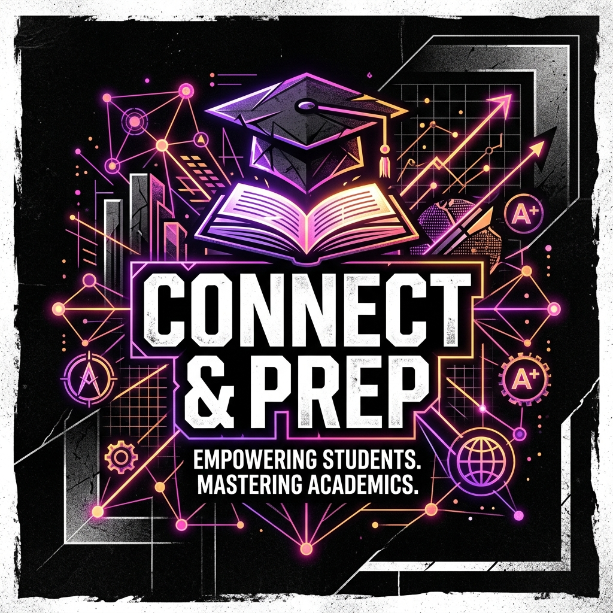
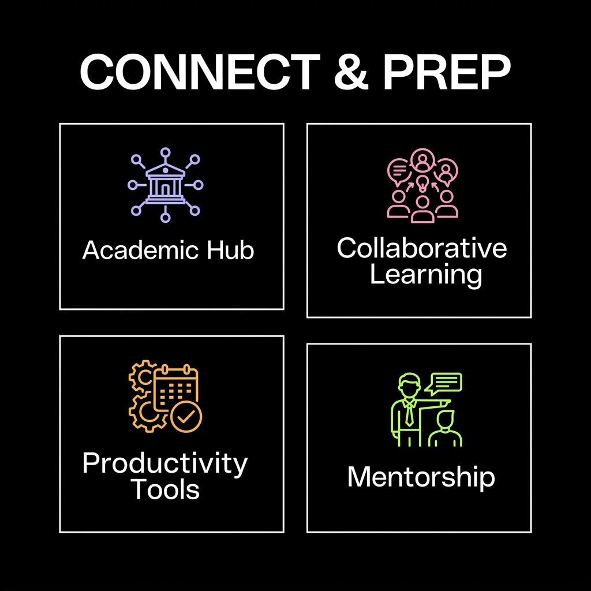
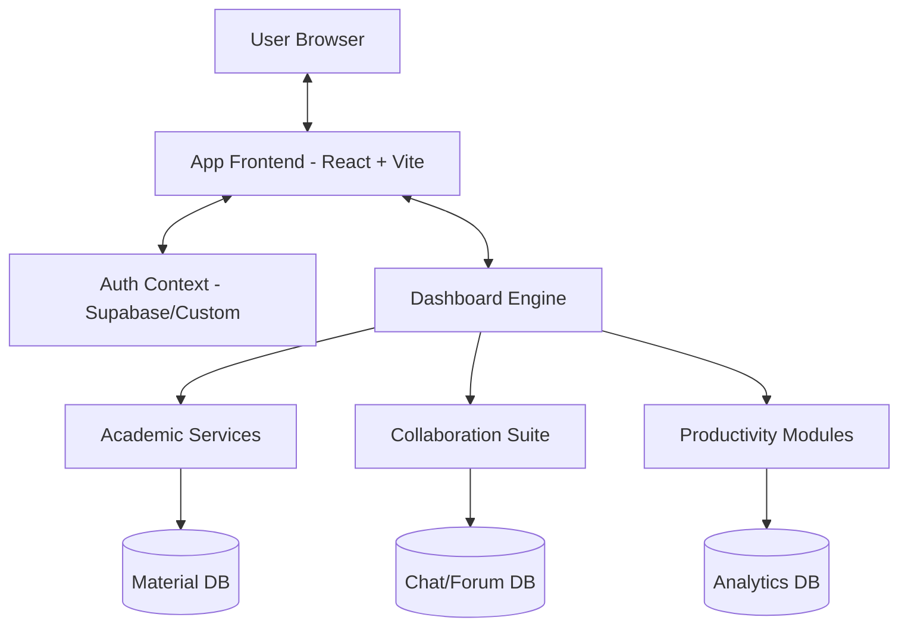

# Connect & Prep 📚



**Connect & Prep** is a state-of-the-art, student-centric academic ecosystem designed to streamline the engineering journey. Built with a high-fidelity **Dark Neo-Brutalist** aesthetic, it bridges the gap between scattered resources and effective learning.

---

## 🚀 Vision & Problem Statement

Engineering students often find themselves lost in a sea of fragmented data. From WhatsApp group notes to random Google Drive links, academic life is cluttered. **Connect & Prep** is the antidote—a centralized hub for mastering academics through collaboration, advanced analysis, and structured resources.

### ❓ The Problem
- **Fragmentation**: Resources (PYQs, Notes) spread across multiple platforms.
- **Academic Isolation**: Lack of seamless peer-to-peer mentorship and group study formats.
- **Tracking Fatigue**: Manual monitoring of attendance, CGPA, and deadlines.
- **Resource Scarcity**: Difficulty in locating verified study materials and alumni networks.

### ✅ The Solution
A unified command center that integrates every aspect of student life:
- **Centralized Repositories**: One home for all PYQs, notes, and academic papers.
- **Collaborative Space**: Real-time whiteboarding, doubt solving, and group study zones.
- **Performance Analytics**: AI-powered analysis of results and attendance tracking.
- **Career & Community**: Direct connection to alumni and placement hubs.

---

## 💎 Core Pillars



### 🏫 Academic Hub
- **Question Paper Hub**: Deep database of previous years' questions categorized by subject.
- **Notes Repository**: High-quality, peer-verified notes from top students.
- **Library Integration**: Real-time status of academic books and digital library access.

### 🤝 Collaborative Learning
- **Doubt Solving Forum**: Instant peer-to-peer assistance for technical queries.
- **Whiteboard & Study Zone**: Interactive tools for visual learning and exam marathons.
- **Chat & Activity Feed**: Stay updated with the latest campus notifications and student discussions.

### 🛠️ Productivity Suite
- **Attendance Tracker**: Automated monitoring of course presence with alerts.
- **CGPA Calculator**: Visualize your academic path with detailed SGPA/CGPA breakdowns.
- **Timetable Management**: A personalized, dynamic schedule to manage your day.

### 🎓 Mentorship & Beyond
- **Alumni Network**: Reach out to seniors who have walked the path before.
- **Placement Hub**: Industry-specific roadmaps and career preparation resources.
- **Gamified Progress**: Leaderboards and challenges to keep learning engaging.

---

## 🛠️ Technical Architecture



### 🧬 Tech Stack
- **Frontend**: [React.js](https://reactjs.org/) + [Vite](https://vitejs.dev/)
- **State Management**: React Context API
- **Routing**: React Router v6
- **Styling**: Vanilla CSS (Custom Neo-Brutalist Design System)
- **Visuals**: Dynamic SVGs & Mermaid Diagrams

---

## 🏁 Development Setup

Follow these steps to get your local environment running:

```bash
# 1. Clone the repository
git clone https://github.com/your-username/connect-and-prep.git

# 2. Enter the directory
cd connect-and-prep

# 3. Install the dependencies
npm install

# 4. Launch the developer server
npm run dev
```

---

## 📂 Project Structure

```text
src/
├── components/
│   ├── auth/          # Login & Authentication
│   ├── features/      # All 30+ Core Modules (Notes, Papers, etc.)
│   └── layout/        # Dashboard Shell & Navigation
├── context/           # Global State Management
├── services/          # API & Backend Interactions
└── App.jsx            # Routing & Core Logic
```

---

<div align="center">

**Connect & Prep** — *Empowering Students. Mastering Academics.*

Made with ❤️ for the Engineering Community

</div>
